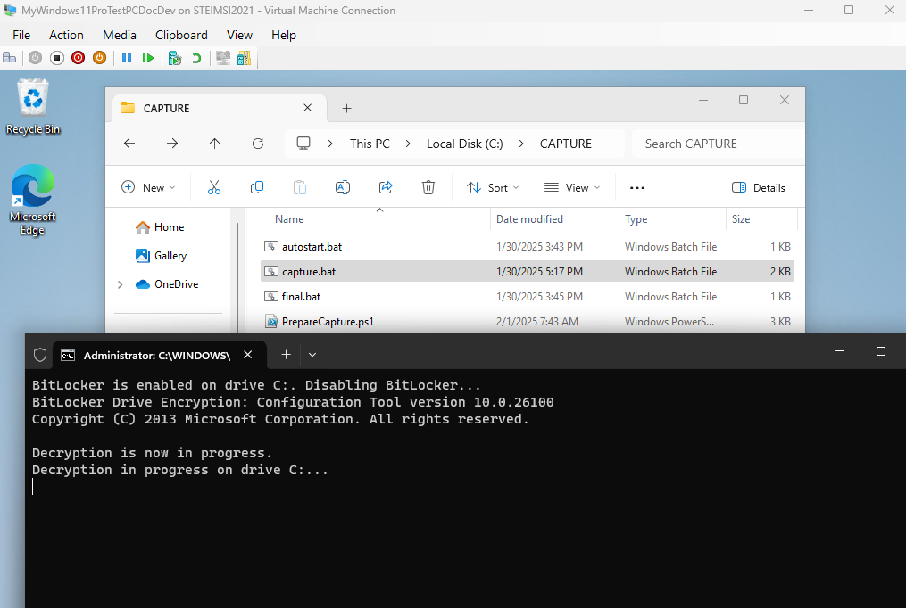
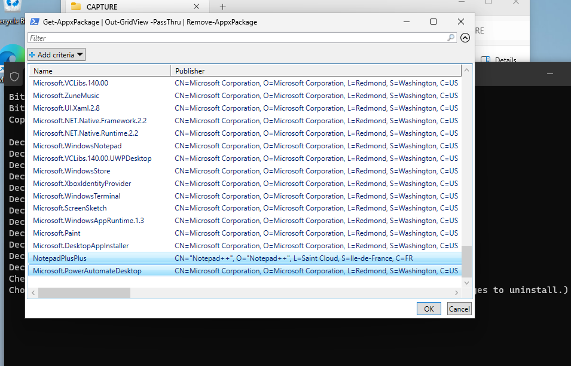
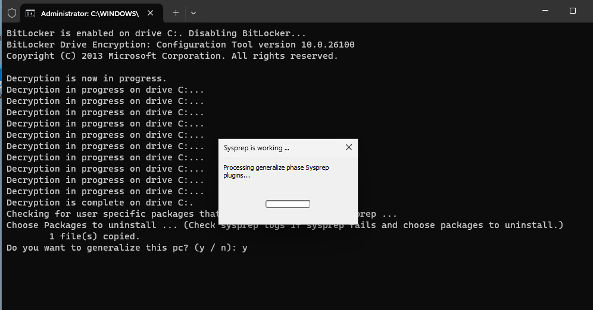
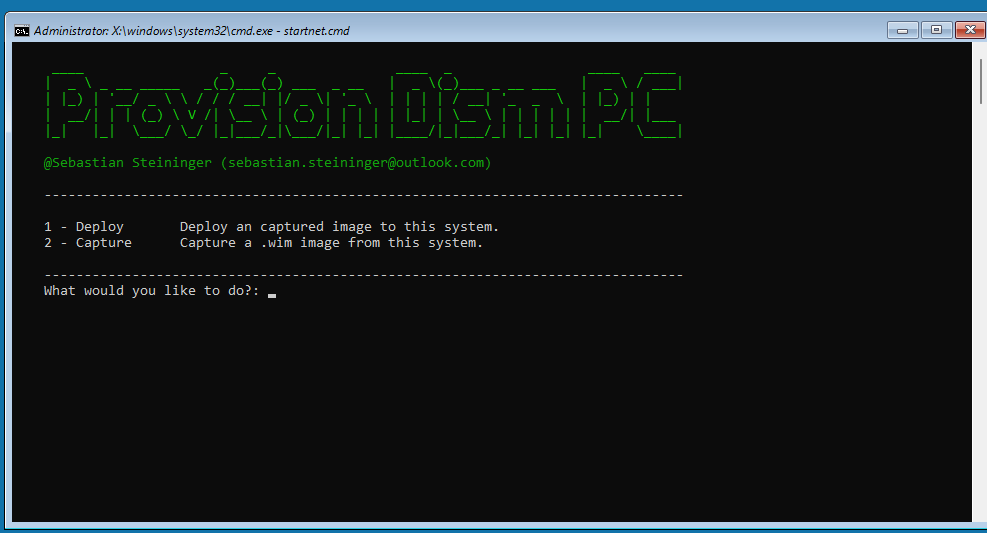
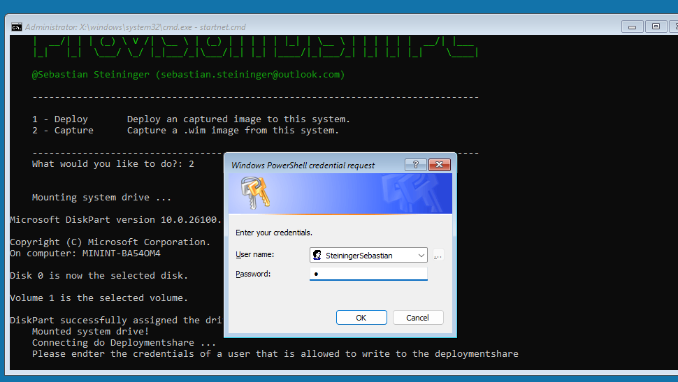
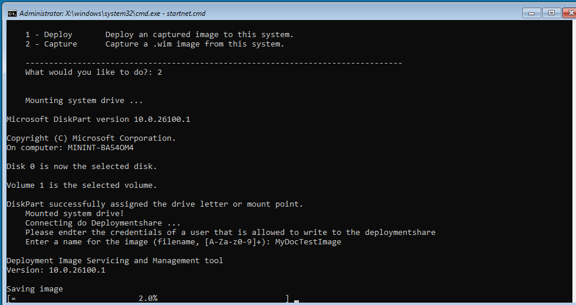
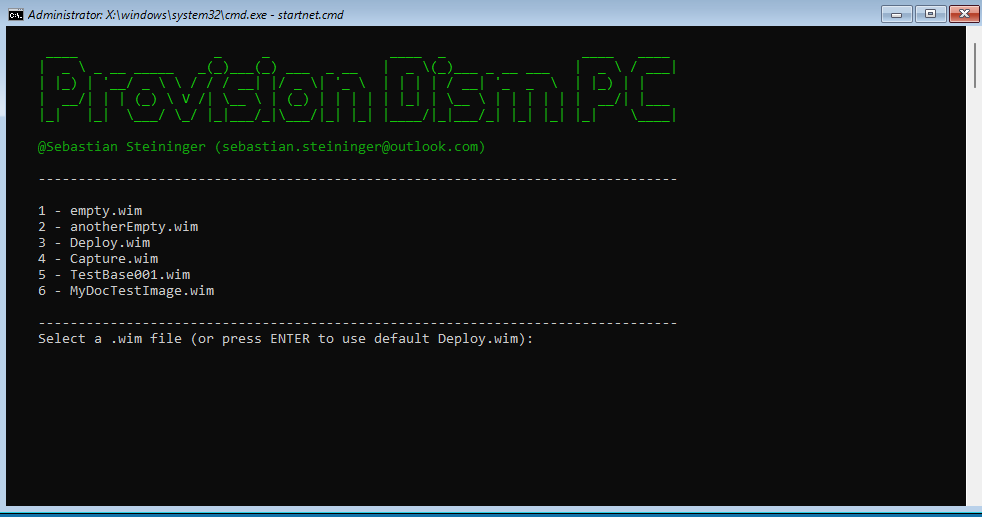
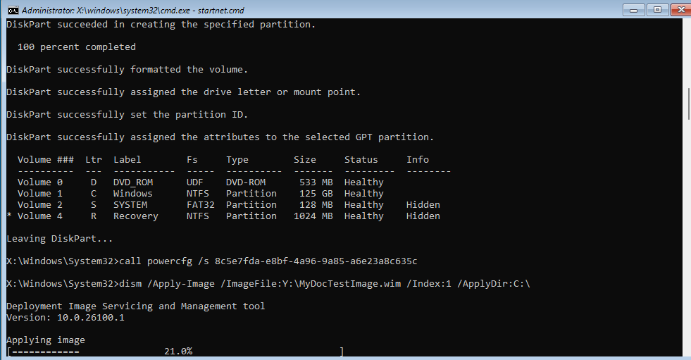

# Introduction

**Repository**: [https://github.com/SteiningerSebastian/ProvisionDismPC](https://github.com/SteiningerSebastian/ProvisionDismPC)

This document details **creating**, **customizing**, **capturing** an image of, and **deploying a Windows 11** virtual machine (VM) using Hyper-V on Windows (see [https://learn.microsoft.com/en-us/windows-server/virtualization/hyper-v/get-started/create-a-virtual-machine-in-hyper-v?tabs=hyper-v-manager](https://learn.microsoft.com/en-us/windows-server/virtualization/hyper-v/get-started/create-a-virtual-machine-in-hyper-v?tabs=hyper-v-manager)).

ProvisionDismPC offers a **streamlined approach** to **capturing and deploying Windows** images from **Hyper-V** Windows installations. Leveraging **command-line and PowerShell scripts**, as well as native Windows tools, it simplifies the entire process.

# Creating and Preparing a Windows 11 Virtual Machine in Hyper-V

## Prerequisites:

- A Windows system with Hyper-V enabled.
- Windows 11 installation media (ISO file).
- The provided files (TODO: LINK GOES HERE)
- Windows Deployment Services (WDS Server installed)
- A Network-Share to store the images. (Called deployment share but really is only a network share with captured image and images to deploy)

## Prepare the System

### Creating the Hyper-V Virtual Machine

- Open Hyper-V Manager.
- In the Actions pane, click "New" and then "Virtual Machine."
- Follow the New Virtual Machine Wizard
  - **Before You Begin:** Click "Next."
  - **Specify Name and Location:** Provide a descriptive name for the VM (e.g., "Windows 11 - Audit"). Choose a location to store the VM files. Click "Next."
  - **Assign Memory:** Allocate at least 4096 MB (4 GB) of RAM. Windows 11 requires a minimum of 4GB, and more is recommended for better performance. Click "Next."
  - **Configure Networking:** Select a virtual switch to connect the VM to your network. If you haven't created a virtual switch, you'll need to do so. (External Switch for access to your deploymentshare.) Click "Next."
  - **Connect Virtual Hard Disk:** Create a new virtual hard disk. Specify the size and location. Ensure the disk is large enough for Windows 11 and any additional software you plan to install. Click "Next."
  - **Installation Options:** Select "Install an operating system from a bootable CD/DVD-ROM" and choose the ISO image file containing your Windows 11 installation media. Click "Next."
  - **Completing the New Virtual Machine Wizard**: Review the settings and click "Finish" to create the VM.

### Starting the VM and Completing the Installation (in Audit Mode)

- Start the newly created VM.
- The VM will boot from the Windows 11 ISO.
- Follow the setup dialog to install Windows 11 to the VM.
- After the installation finished, boot Windows 11. **DO NOT CONTINUE WITH THE OUT OF THE BOX EXPERIENCE**. Use STRG + SHIFT + F3 to enter Audit Mode.

### Customize the installation

- Perform any desired pre-customization or software installation within Audit Mode.
- **WARNING**: Always shut down the system using the dialog, select Audit Mode and Shutdown. MAKE SURE GENERALIZE **IS NOT SELECTED**. (Alternatively you can use the commandline `%windir%/System32/Sysprep/sysprep.exe /audit /shutdown`)
- Recommendation: Utilize checkpoints for easy rollback to a previous working state.
- Recommendation: For sharing or further customization, create full VM backups by copying the VM directory.

### Key Considerations

- **Memory Allocation:** Windows 11 requires at least 4096 MB of RAM. Allocate more if possible for improved performance.
- **Disk Space:** Ensure the virtual hard disk has sufficient space for Windows 11 and any additional software.
- **Audit Mode:** Audit Mode is a powerful tool for pre-configuring Windows installations. Remember to shut down the VM correctly while in Audit Mode to avoid potential issues.

# Prepare the machine for capture

## Preparing the Capture Environment

### Copying the Capture Folder

Copy the `CAPTURE` folder to `C:\`. (**Ensure MO passwords are saved on the network share.** Do not install Hyper-V client tools on the capture machine.)

### Capture Folder Contents

All contents within the **`CAPTURE` folder** will be **deleted upon startup**. Place any files that should **NOT be included in the final image** here. **Only add files; do not create subfolders.**

### Post-Login Customization

Customize or add steps to be **executed once after the initial administrator login** by modifying the **`Setup.ps1` script**.

## Background Information

- `capture.bat`: Prepares the PC for image capture and initiates `Preparecapture.ps1`.
- `Preparecapture.ps1`: Prepares the computer for the capture process.
- `autostart.bat`: Copied to the autostart folder and removed after execution. Starts `setupAutostart.bat`.
- `setupAutostart.bat`: Sets PowerShell policies for the `Setup.ps1` script and executes it. Also calls `final`, which handles cleanup.

## Unattended Installation

### Unattend File

Copy the **unattended installation file** to the directory as `unattend.xml`. A tool like [https://www.windowsafg.com/win10x86_x64_uefi.html](https://www.windowsafg.com/win10x86_x64_uefi.html) can be used to generate this file.

### Profile Settings

To **copy profile settings**, add or replace the following code within the `specialize` phase of the **unattend.xml** file. **Note:** Some settings must be configured using the domain and cannot be copied directly.

```xml
<component name="Microsoft-Windows-Shell-Setup" processorArchitecture="amd64"
    publicKeyToken="31bf3856ad364e35" language="neutral" versionScope="nonSxS"
    xmlns:wcm="[http://schemas.microsoft.com/WMIConfig/2002/State](http://schemas.microsoft.com/WMIConfig/2002/State)"
    xmlns:xsi="[http://www.w3.org/2001/XMLSchema-instance](http://www.w3.org/2001/XMLSchema-instance)">
    <ComputerName>MyCustomPC</ComputerName>
    <CopyProfile>true</CopyProfile>
    <DoNotCleanTaskBar>true</DoNotCleanTaskBar>
</component>
```

## Application Installation and Customization

After **creating a backup and/or checkpoint**, install your desired programs and **customize the installation**. Install all programms for the entire system, **NO USER ONLY installed applications/programs allowed!** Do **NOT download applications from the Windows Store**, these must be injected using the domain.\*\*

Make sure to **delete all files from user-specific folders** that should not be available to all Domain-Users (generalized Profile)!

## Capturing the Image

Once customization is complete and a backup/checkpoint has been created, run the `capture.bat` from the `CAPTURE` folder script. This will **prepare the system for capture**.



If you receive an error about another instance running on this device, close the dialog that is automatically started.

**Don't worry about the unencryption** of the drive, this is **necessary in order to capture** the drive.

You may be prompted twice to select appx packages to uninstall:

- The first prompt displays packages installed exclusively for the current user (and will only appear if such packages exist).
- The second prompt displays all packages that might prevent generalization of the profile.



Check `C:\windows\logs\dism\dism.log` after a failed attempt. Revert to the checkpoint, select the appropriate packages to uninstall, and try the capture process again.



After the system powers off, **do not boot into the captured image yet.**

# Prepare WindowsPE and ProvisionDismPC to capture and deploy images.

On your host machine **install the Windows ADK** and the **PE extension** [https://learn.microsoft.com/en-us/windows-hardware/get-started/adk-install](https://learn.microsoft.com/en-us/windows-hardware/get-started/adk-install)

Open the folder `WindowsPEIsoMaker`, select the file `DeployCapture.ps1` and open it in a text editor, there you will find a section Constants change the settings to fit you configuration

```Powershell
# ---------------------------- Constants ----------------------------
#
# TODO: Change so it works with your config
# WARNING: THIS IS NOT SECURE !!! Because we want the share to connect automatically we need to write down the username and password
# of a user that can read the network share. MAKE SURE that the user has NO other privileges then reading from the network share!!!
# Consider the NETWORK SHARE to be PUBLIC at this point. (DO NOT STORE ANYTHING IMPORTANT ON THAT SHARE THAT CAN NOT BE MADE PUBLIC!!!)

$networkPath = "\\famstein\www\deploymentshare"

$readOnlyUser = "ReadOnlyUser"
$readOnlyUserPassword = "<password>"

# This user is used to capture an image, the password is requested before capture.
$captureUser = "ReadWriteUser"

# The file selected to deploy, if not user selection is made
$defaultFile = "Deploy.wim"

# If capture does not work, change these settings to mount the correct volume to capture.
$content = "select disk 0
select volume 1
assign letter=C"

# -------------------------- END Constants --------------------------
```

## Customizing the Image

You can customize the WindowsPE image by modifying the settings in the `CustomizeImage.bat` file. This script allows you to **configure the image according to your requirements**.

1. Open `CustomizeImage.bat` in a text editor.
2. Modify the script as needed.
3. Save the changes.

## Creating the Image

After customizing the image, you need to **create an `.iso` file** from the configuration.

1. Execute `MakeImage.bat`.
   - This script will generate an `.iso` file based on the configuration and scripts.
2. When prompted, select **Yes** if you would like to create an `.iso` file. (Before this step you can make **manual changes to the image**.)

## Mounting the Image and Adding to WDS

Once the **`.iso` file** is created, you need to **mount it** and add the boot image to Windows Deployment Services (WDS).

1. Mount the `.iso` file.
2. Navigate to the `sources` folder and locate the `boot.wim` file.
3. Add `boot.wim` to WDS as a **boot image**.
   - **Important**: Do **not** add the install image.

### Adding Boot Image in WDS

For a visual guide on how to add a boot image to WDS, watch the following video from **0:28 to 1:15**:
[](https://www.youtube.com/watch?v=5A6R6-i2cRw)

## Injecting Network Drivers

**Network drivers are essential** for Windows PE to access the deployment share. Ensure you **inject the necessary drivers** into the boot image.

1. Inject the network drivers into the `boot.wim` file.
2. Verify that the drivers are correctly added.

### Add Network Driver to WDS Boot Image

For a detailed guide on injecting network drivers, watch this video:
[](https://www.youtube.com/watch?v=3zt6UR1Igzs)

## Capturing the Image

To capture an image, **boot the target machine** from the network using the **pre-configured image**.

1. Boot the target PC from the network.
2. Select the **Capture** option.
   
   - **Warning:** If the PC boots past this step and loads the normal windows installation, the **installation will be unusable**. You must revert to the checkpoint / load the backup and resysprep it by running `capture.bat`.
3. Enter the required credentials after the image is mounted.
   
4. Provide a name for the captured image.
5. Wait for the capture process to complete.
   

## Applying the Image

To **deploy the captured image**, rist copy the files **`ApplyImage.bat` and `CreatePartitions-UEFI.txt` from `Deploymentsahre`** on to your **network share**. In these files you can change the letters of the partitions and their sizes. Then **boot the target machine from the network** and select the appropriate options.

1. Boot the target PC from the network.
2. Select the **Deploy** option.
   
3. Choose the image to deploy or press **Enter** to use the default image.
   
4. Wait for the image to be applied to the target machine.
   
5. Restart the PC and log in.
6. Allow the startup scripts to finish running.
7. Your PC is now ready for use.

By following this documentation, you can **successfully customize, create, capture, and deploy Windows images** using ProvisionDismPC and WDS. Refer to the linked videos for additional visual guidance.

# Good Bye!

I hope this guide enables you to successfully create and deploy your own Windows11 image!

**Cheers!**

_Sebastian_

# Sources

Here some sources to check out:

- DSIM (Capture System) [https://learn.microsoft.com/en-us/windows-hardware/manufacture/desktop/dism-unattended-servicing-command-line-options?view=windows-11](https://learn.microsoft.com/en-us/windows-hardware/manufacture/desktop/dism-unattended-servicing-command-line-options?view=windows-11)
- Boot in Audit Mode [https://learn.microsoft.com/en-us/windows-hardware/manufacture/desktop/boot-windows-to-audit-mode-or-oobe?view=windows-11](https://learn.microsoft.com/en-us/windows-hardware/manufacture/desktop/boot-windows-to-audit-mode-or-oobe?view=windows-11)
- Generalize [https://learn.microsoft.com/en-us/windows-hardware/customize/desktop/unattend/microsoft-windows-deployment-generalize](https://learn.microsoft.com/en-us/windows-hardware/customize/desktop/unattend/microsoft-windows-deployment-generalize)
- Sysprep (Generalize) [https://learn.microsoft.com/en-us/windows-hardware/manufacture/desktop/sysprep--generalize--a-windows-installation?view=windows-11](https://learn.microsoft.com/en-us/windows-hardware/manufacture/desktop/sysprep--generalize--a-windows-installation?view=windows-11)
- Capture and Apply .wim [https://learn.microsoft.com/en-us/windows-hardware/manufacture/desktop/capture-and-apply-windows-using-a-single-wim?view=windows-11](https://learn.microsoft.com/en-us/windows-hardware/manufacture/desktop/capture-and-apply-windows-using-a-single-wim?view=windows-11)
- Awnserfile with Sysprep [https://learn.microsoft.com/en-us/windows-hardware/manufacture/desktop/use-answer-files-with-sysprep?view=windows-11](https://learn.microsoft.com/en-us/windows-hardware/manufacture/desktop/use-answer-files-with-sysprep?view=windows-11)
- Create Bootable Media [https://learn.microsoft.com/en-us/windows-hardware/manufacture/desktop/winpe-create-usb-bootable-drive?view=windows-11](https://learn.microsoft.com/en-us/windows-hardware/manufacture/desktop/winpe-create-usb-bootable-drive?view=windows-11)
- Powershell Support of WindowsPE [https://learn.microsoft.com/en-us/windows-hardware/manufacture/desktop/winpe-adding-powershell-support-to-windows-pe?view=windows-11](https://learn.microsoft.com/en-us/windows-hardware/manufacture/desktop/winpe-adding-powershell-support-to-windows-pe?view=windows-11)
- Wpeinit and Startnet.cmd [https://learn.microsoft.com/en-us/windows-hardware/manufacture/desktop/wpeinit-and-startnetcmd-using-winpe-startup-scripts?view=windows-11](https://learn.microsoft.com/en-us/windows-hardware/manufacture/desktop/wpeinit-and-startnetcmd-using-winpe-startup-scripts?view=windows-11)
- unattend.xml Generator [https://www.windowsafg.com/win10x86_x64_uefi.html](https://www.windowsafg.com/win10x86_x64_uefi.html)

---

**Copyright © 2025 Sebastian Steininger. All rights reserved.**

This work, including but not limited to documentation, code, and associated materials, is the intellectual property of Sebastian Steininger, **where original**. Unauthorized commercial use, reproduction, distribution, or modification of this work is strictly prohibited without prior written consent from the author.

**Third-Party Content**

Portions of this work may include content derived or copied from other authors, either under license or as non-original work. These parts are explicitly marked and are not subject to the same copyright restrictions as the original work. All rights to such third-party content remain with their respective owners.

**Permissions**

- **Non-commercial use by individuals and non-profit organizations is permitted**, provided that proper attribution is given to the author for the original portions of this work.
- For any other use, including commercial purposes, please contact sebastian.steininger@outlook.com for permission.

**Disclaimer**

This work is provided "as is," without any warranties or guarantees of any kind, express or implied. The author shall not be held liable for any damages, losses, or issues arising from the use of this work. By using this work, you agree to these terms.

**Attribution Example:**  
If you use this work, please include the following attribution:  
"Portions of this work are based on original material by Sebastian Steininger, © 2025. Used under non-commercial terms."
